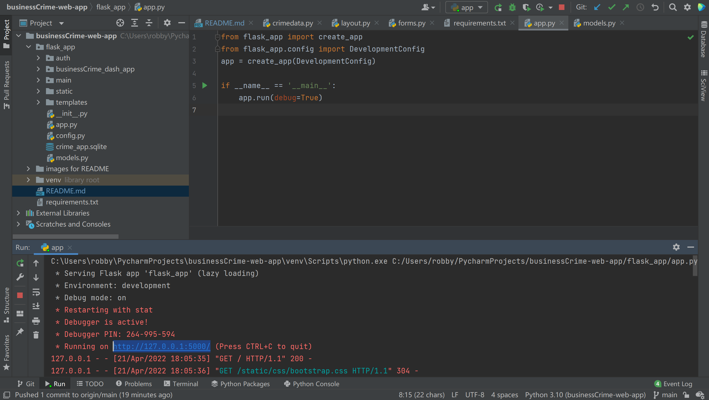

# businessCrime-web-app
## Introduction

London Crime is a flask, web-based application created to display recent crime statistics in London, aiming to help 
police officers conduct analysis and help citizens protect themselves. To provide a straightforward visual display of crime data, 
the web app showcases total crime cases in London from 2020 to 2021 in a dashboard sorted by crime types and borough levels. 
The data is provided by Metropolitan Police Service.

Users can access the crime dashboard by registering an account on the web app (with an email address),
they can create or modify their user profile (i.e. profile photo, region, personal description)

## instruction to run the web app
Firstly, install all packages required in the file 'requirements.txt'. It can be done by typing the command below in the terminal
```python
pip install -r requirements.txt
```
Secondly, double-click the app.py file in business crime app folder and go to the bottom
```python
if __name__ == '__main__':
    app.run(debug=True)
```
run it and click the 'http://127.0.0.1:5000/'.

## Instructions to use the web app

### Sign up and login (to access business crime dashboard)
- User can sign up an account with an email, and log in to view the crime dashboard
  

Then click the 'Dashboard' in the navigation bar:

Click the 'go back' button to go back to home page.

### User profile (can be created or updated)
After you have logged in:


To search a user profile:

